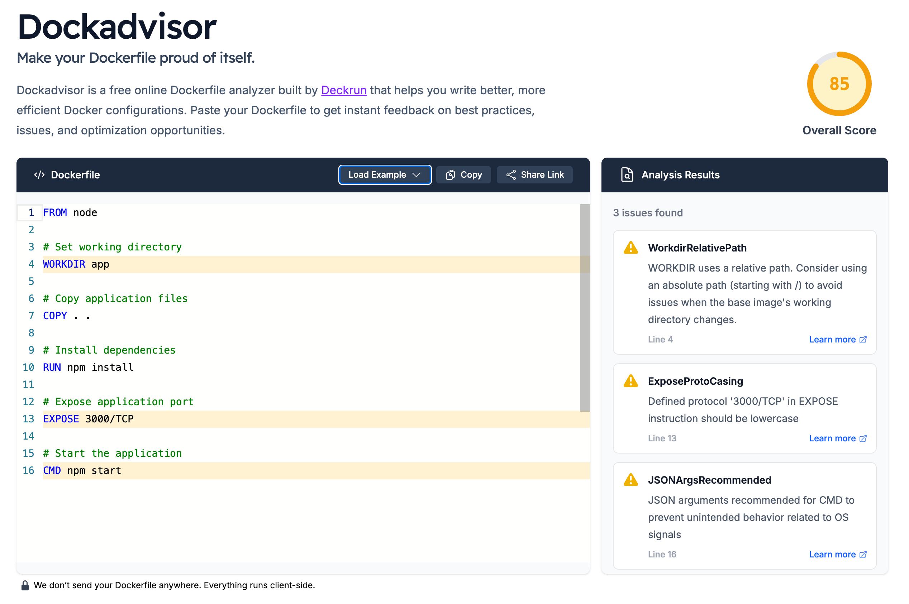

# Dockadvisor

[![Build Status][ci-badge]][ci-runs] [![Go Reference][reference-badge]][reference] [](https://goreportcard.com/report/github.com/deckrun/dockadvisor)

A fast, lightweight Dockerfile linter written in Go that helps you write better Dockerfiles by detecting common issues and anti-patterns.

## Features

- **Fast & Lightweight**: Built with Go for optimal performance, with WebAssembly support for browser execution
- **Comprehensive Validation**: 60+ rules covering all standard Dockerfile instructions, multi-stage builds, and security best practices
- **Clear Feedback**: Actionable error messages with line numbers, severity levels, and links to Docker documentation
- **Quality Scoring**: Get a 0-100 score based on rule violations to track Dockerfile quality over time
- **Security-Aware**: Detects potential secrets in variables, validates ARG scoping, and checks for undefined references

## Installation

### Install CLI using Go

```bash
go install github.com/deckrun/dockadvisor/cmd/dockadvisor@latest
```

### Build CLI from Source

```bash
git clone https://github.com/deckrun/dockadvisor.git
cd dockadvisor
make build
```

### WebAssembly Build

```bash
# Build with standard Go compiler
make build-wasm
```

## Usage

### As a Web Interface



Run Dockadvisor using Docker Compose:
```bash
# Start the web interface using Docker Compose
docker compose up
```

And then access the application at http://localhost:3030

### As a Go Library

```go
package main

import (
    "log"
    "github.com/deckrun/dockadvisor/parse"
)

func main() {
    dockerfileContent := `
FROM alpine:latest as builder
WORKDIR usr/app
RUN echo "Hello World"
`

    result, err := parse.ParseDockerfile(dockerfileContent)
    if err != nil {
        log.Fatal("Error parsing Dockerfile:", err)
    }

    for _, rule := range result.Rules {
        log.Printf("Line %d-%d: [%s] %s (Severity: %s)\n",
            rule.StartLine,
            rule.EndLine,
            rule.Code,
            rule.Description,
            rule.Severity,
        )
    }

    log.Printf("Dockerfile Score: %d/100\n", result.Score)
}
```

### As a WebAssembly Module

```javascript
// Load the WASM module
const go = new Go();
WebAssembly.instantiateStreaming(fetch("dockadvisor.wasm"), go.importObject)
    .then((result) => {
        go.run(result.instance);

        // Call the parseDockerfile function
        const dockerfileContent = `
FROM alpine:latest as builder
WORKDIR usr/app
`;

        const result = parseDockerfile(dockerfileContent);

        if (result.success) {
            console.log("Score:", result.score);
            console.log("Rules:", result.rules);
            result.rules.forEach(rule => {
                console.log(`  ${rule.code} (${rule.severity}): ${rule.description}`);
            });
        } else {
            console.error("Error:", result.error);
        }
    });
```

## API Reference

### ParseDockerfile

```go
func ParseDockerfile(dockerfileContent string) (*Result, error)
```

Parses a Dockerfile and returns validation results.

**Parameters:**
- `dockerfileContent` (string): The content of the Dockerfile to analyze

**Returns:**
- `*Result`: Contains an array of `Rule` objects and a quality score
- `error`: Error if parsing fails

### Result Structure

```go
type Result struct {
    Rules []Rule // Array of rule violations
    Score int    // Quality score from 0-100 (100 = perfect)
}
```

### Rule Structure

```go
type Severity string

const (
    SeverityError   Severity = "error"   // Build failures, invalid syntax
    SeverityWarning Severity = "warning" // Best practices, style issues
)

type Rule struct {
    StartLine   int      // Line where the issue starts
    EndLine     int      // Line where the issue ends
    Code        string   // Rule code (e.g., "FromAsCasing")
    Description string   // Human-readable description
    Url         string   // Link to documentation
    Severity    Severity // Rule severity level
}
```

### Scoring System

Dockadvisor calculates a quality score (0-100) based on the severity of detected issues:

- **Perfect Dockerfile**: Score of 100 (no violations)
- **Error penalties**: -15 points each (invalid syntax, build failures)
- **Warning penalties**: -5 points each (style issues, best practices)
- **Minimum score**: 0 (score is capped at zero)

**Severity Classifications:**

- **Errors** (-15 points): Issues that will cause build failures or invalid syntax
  - `InvalidInstruction`, `UndefinedVar`, `DuplicateStageName`
  - Missing arguments, invalid formats

- **Warnings** (-5 points): Best practices and style recommendations
  - `FromAsCasing`, `WorkdirRelativePath`, `StageNameCasing`
  - `SecretsUsedInArgOrEnv`, `MaintainerDeprecated`

**Example:**
- Dockerfile with 2 errors and 3 warnings: `100 - (2×15) - (3×5) = 55/100`

## Validation Rules

Dockadvisor validates Dockerfiles against Docker best practices with comprehensive rule coverage.

### Supported Instructions

All standard Dockerfile instructions are validated:

- **FROM** - Base image specification and multi-stage builds
- **RUN** - Execute commands during build
- **WORKDIR** - Set working directory
- **EXPOSE** - Document exposed ports
- **CMD** - Default command for container
- **ENTRYPOINT** - Configure container executable
- **SHELL** - Override default shell
- **VOLUME** - Create mount points
- **USER** - Set user and group
- **LABEL** - Add metadata key-value pairs
- **ENV** - Set environment variables
- **ARG** - Define build-time variables
- **COPY** - Copy files from build context
- **ADD** - Copy files with additional features
- **HEALTHCHECK** - Configure container health checks
- **ONBUILD** - Add trigger instructions for derived images
- **STOPSIGNAL** - Set signal to stop container
- **MAINTAINER** - Set author metadata (deprecated)

### Rule Categories

#### Global Validation Rules

These rules apply across the entire Dockerfile:

- **ConsistentInstructionCasing** (Warning) - All instructions should use consistent casing (all uppercase or all lowercase)
- **NoEmptyContinuation** (Warning) - Empty lines following backslash continuations are deprecated
- **DuplicateStageName** (Error) - Stage names in multi-stage builds must be unique
- **FromPlatformFlagConstDisallowed** (Warning) - Platform flags should not use ARG variables as constant values
- **JSONArgsRecommended** (Warning) - CMD and ENTRYPOINT should use JSON array format for better signal handling
- **UndefinedArgInFrom** (Error) - ARG variables used in FROM must be defined before the FROM instruction
- **UndefinedVar** (Error) - Variables used in instructions must be defined via ARG or ENV
- **MultipleInstructionsDisallowed** (Error) - Only one CMD, HEALTHCHECK, or ENTRYPOINT allowed per stage
- **SecretsUsedInArgOrEnv** (Warning) - Sensitive variable names (password, token, secret, etc.) should not be defined in ARG or ENV
- **InvalidDefaultArgInFrom** (Error) - Default ARG values cannot be used in FROM instructions

#### Instruction-Specific Rules

**FROM Instruction:**
- **FromMissingImage** (Error) - FROM requires an image reference
- **FromInvalidImageReference** (Error) - Image reference format is invalid
- **FromAsCasing** (Warning) - 'AS' keyword should be lowercase
- **StageNameCasing** (Warning) - Stage names should be lowercase
- **FromInvalidStageName** (Error) - Stage name contains invalid characters
- **ReservedStageName** (Error) - Stage name cannot be 'context' or 'scratch' (reserved)
- **FromInvalidPlatform** (Error) - Platform flag format is invalid
- **RedundantTargetPlatform** (Warning) - TARGETPLATFORM variable is implicitly available

**RUN Instruction:**
- **RunMissingCommand** (Error) - RUN requires a command
- **RunInvalidExecForm** (Error) - Invalid JSON format for exec form
- **RunInvalidMountFlag** (Error) - Invalid --mount flag format
- **RunInvalidNetworkFlag** (Error) - Invalid --network flag value
- **RunInvalidSecurityFlag** (Error) - Invalid --security flag value

**WORKDIR Instruction:**
- **WorkdirRelativePath** (Warning) - WORKDIR should use absolute paths

**EXPOSE Instruction:**
- **ExposeInvalidFormat** (Error) - Port must be a number or range
- **ExposePortOutOfRange** (Error) - Port numbers must be 1-65535
- **ExposeInvalidProtocol** (Error) - Protocol must be tcp or udp
- **ExposeProtoCasing** (Warning) - Protocol should be lowercase

**CMD Instruction:**
- **CmdMissingCommand** (Error) - CMD requires a command
- **CmdInvalidExecForm** (Error) - Invalid JSON format for exec form

**ENTRYPOINT Instruction:**
- **EntrypointMissingCommand** (Error) - ENTRYPOINT requires a command
- **EntrypointInvalidExecForm** (Error) - Invalid JSON format for exec form

**SHELL Instruction:**
- **ShellMissingConfig** (Error) - SHELL requires shell configuration
- **ShellRequiresJsonForm** (Warning) - SHELL should use JSON array format
- **ShellInvalidJsonForm** (Error) - Invalid JSON format

**VOLUME Instruction:**
- **VolumeMissingPath** (Error) - VOLUME requires at least one path
- **VolumeInvalidJsonForm** (Error) - Invalid JSON format for volume paths

**USER Instruction:**
- **UserMissingValue** (Error) - USER requires a user name or UID
- **UserInvalidFormat** (Error) - Invalid user:group format

**LABEL Instruction:**
- **LabelMissingKeyValue** (Error) - LABEL requires key=value pairs
- **LabelInvalidFormat** (Error) - Invalid label format

**ENV Instruction:**
- **EnvMissingKeyValue** (Error) - ENV requires key=value pairs
- **EnvInvalidFormat** (Error) - Invalid environment variable format
- **LegacyKeyValueFormat** (Warning) - Use key=value format instead of legacy space-separated format

**ARG Instruction:**
- **ArgMissingName** (Error) - ARG requires a variable name
- **ArgInvalidFormat** (Error) - Invalid ARG format

**COPY Instruction:**
- **CopyMissingArguments** (Error) - COPY requires at least source and destination
- **CopyInvalidFlag** (Error) - Invalid flag for COPY instruction

**ADD Instruction:**
- **AddMissingArguments** (Error) - ADD requires at least source and destination
- **AddInvalidFlag** (Error) - Invalid flag for ADD instruction

**HEALTHCHECK Instruction:**
- **HealthcheckMissingCmd** (Error) - HEALTHCHECK CMD is required

**ONBUILD Instruction:**
- **OnbuildMissingInstruction** (Error) - ONBUILD requires a chained instruction

**STOPSIGNAL Instruction:**
- **StopsignalMissingValue** (Error) - STOPSIGNAL requires a signal value

**MAINTAINER Instruction:**
- **MaintainerDeprecated** (Warning) - MAINTAINER is deprecated, use LABEL maintainer=... instead
- **MaintainerMissingName** (Error) - MAINTAINER requires a name

**Unrecognized Instructions:**
- **UnrecognizedInstruction** (Error) - Instruction is not a valid Dockerfile instruction

## Star History

<a href="https://www.star-history.com/#deckrun/dockadvisor&type=date&legend=top-left">
 <picture>
   <source media="(prefers-color-scheme: dark)" srcset="https://api.star-history.com/svg?repos=deckrun/dockadvisor&type=date&theme=dark&legend=top-left" />
   <source media="(prefers-color-scheme: light)" srcset="https://api.star-history.com/svg?repos=deckrun/dockadvisor&type=date&legend=top-left" />
   
 </picture>
</a>

## Contributing

See [CONTRIBUTING.md](CONTRIBUTING.md) for guidelines on how to contribute to this project.

## Related Projects

- [hadolint](https://github.com/hadolint/hadolint) - Haskell-based Dockerfile linter
- [dockerfilelint](https://github.com/replicatedhq/dockerfilelint) - Node.js-based linter
- [dockerfile-utils](https://github.com/rcjsuen/dockerfile-utils) - TypeScript Dockerfile utilities

## Support

- 📧 Report issues on [GitHub Issues](https://github.com/deckrun/dockadvisor/issues)
- 💬 Join discussions on [GitHub Discussions](https://github.com/deckrun/dockadvisor/discussions)

---

Made with ❤️ for better Dockerfiles


[ci-badge]:             https://github.com/deckrun/dockadvisor/actions/workflows/test.yml/badge.svg
[ci-runs]:              https://github.com/deckrun/dockadvisor/actions
[reference-badge]:      https://pkg.go.dev/badge/github.com/deckrun/dockadvisor.svg
[reference]:            https://pkg.go.dev/github.com/deckrun/dockadvisor
[go-report-card-badge]: https://goreportcard.com/badge/github.com/deckrun/dockadvisor
[go-report-card]:       https://goreportcard.com/report/github.com/deckrun/dockadvisor


